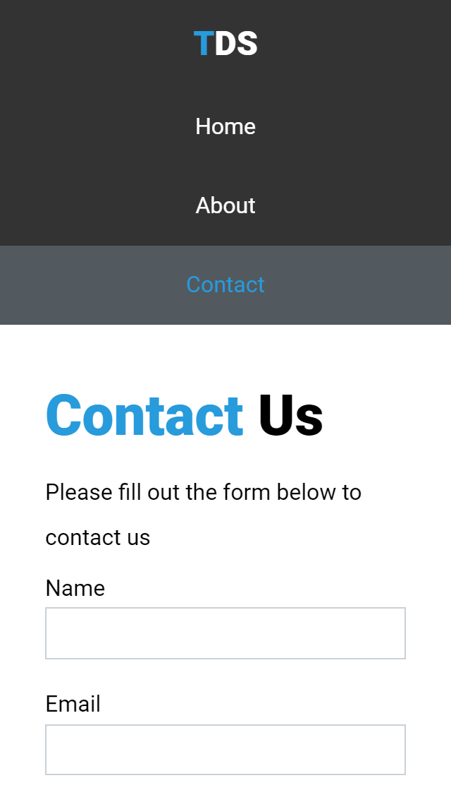

# Tubig Delivery Service

## Description
A website for an imaginary water refilling station. It provides information about its offers and background. Contact form is also provided with only a font-end capability.

Go now to [Tubig Delivery Service](https://www.tds-mrg.netlify.com) website to view it.

## Snapshots
|   Desktop   |   Mobile    |
| ----------- | ----------- |
|  |  |
|  |  |
|  |  |

## Purpose
* Review my HTML & CSS knowledge
* Using float & media query to make a responsive UI

## Color Palette
* blue: #279bdc
* ligh-gray: #f0f8ff
* gray: #52595F
* black: #333333

